# Advanced Linux Commands

I started by listing the files and folders in the linux account 

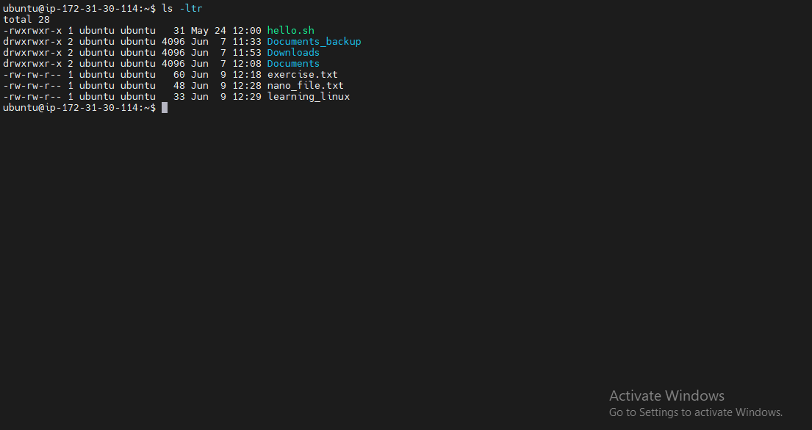

I noticed a lot of files started with `d`, which are directories while some started with `-`, which are files, followed by the directory/file permissions, read, write and execute denoted by `rwx`for the user, group and others.

I subsequently created a file called `script.sh` using the `touch` command. I then used the `ls -ltr` command to see the default permissions granted to the file and used the `chmod` command to grant execute command to all user classes. I then used the numbers approach of the `chmod` command to grant the user full permissions, while the group and others were granted read and execute permission only.

I subsequently created a new file called note.txt, I checked the default permisssion using `ls -ltr`

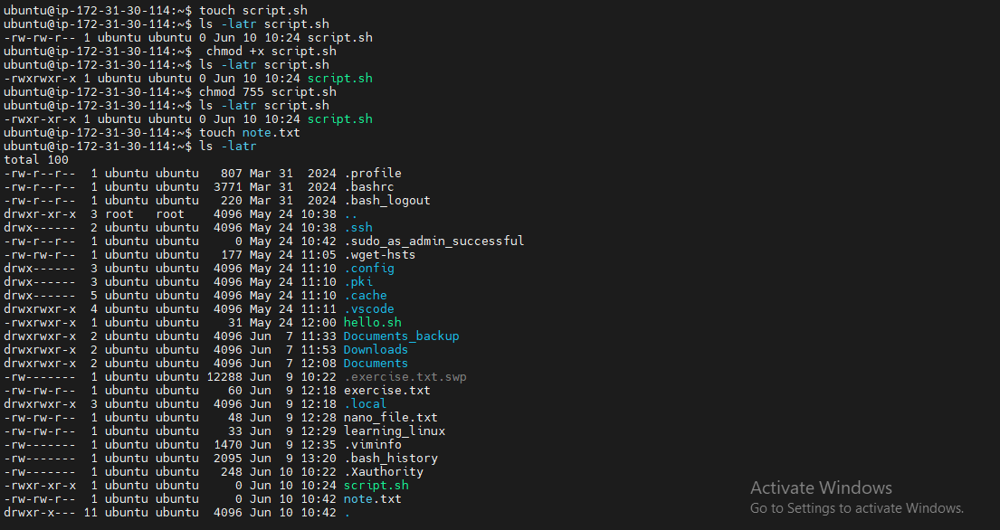

I followed that up by changing the permissions of note.txt to grant the user, group and others full permissions

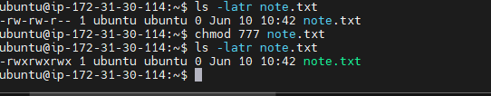

I went on create a group called `developers` and then change the group ownership of `note.txt` from ubuntu to developers

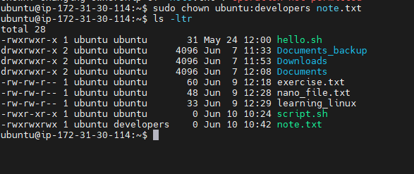

I then switched from the user `ubuntu` to the root user using the command `sudo -i` after which i exited the root user and went back to the user ubuntu

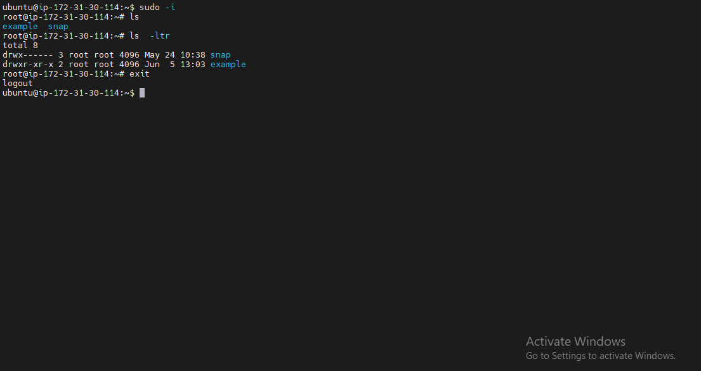

Moving forward I created a new user called `john doe` using the command `sudo adduser`. I was prompted to create a password, input his full name, room number, work number, home number, other to complete the process of creating the new user

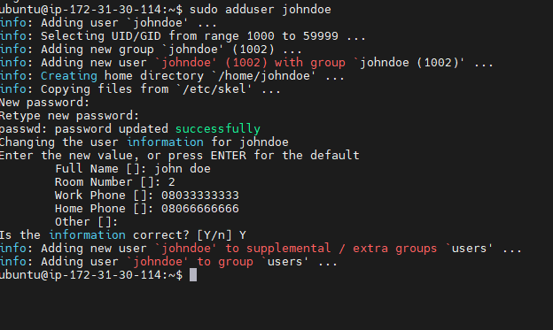

I then added the new user `john doe` to the sudo group using the command `sudo usermod -aG sudo johndoe` 

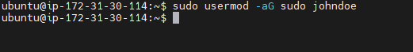

I subsequently switched to the new user, changed to the home directory of the new user and viewed the files of the user

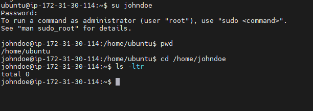

I switched bk to the user `ubuntu` and changed the password of the new user `john doe`

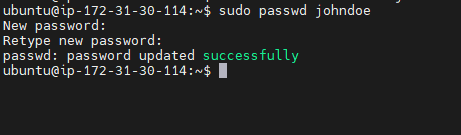

I then logged into `john doe` with the new password

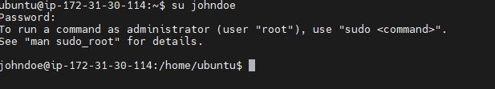

I went on to add johndoe to the `developers` group I had created earlier using the command `sudo usermod -aG developers johndoe`

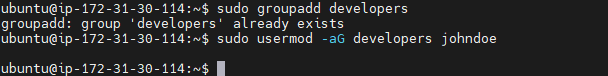

I then confirmed `johndoe` had been added to the developers group by running the command `id johnoe` 

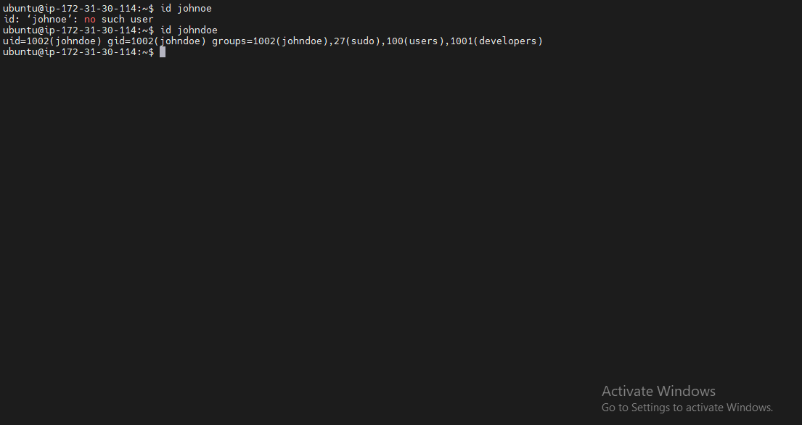

I went on to delete the user `johndoe` by using the command `sudo userdel username` 

I followed that up by changing the group ownership of the `Documents_backup` to `developers` using the `chown` command

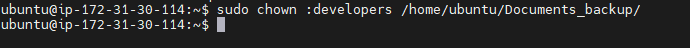

then I also added the read and write permission to the group that owns the `Documents_backup` directory which is the `developers` group

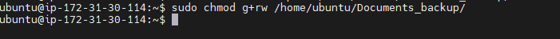

I created the group called `devops` 

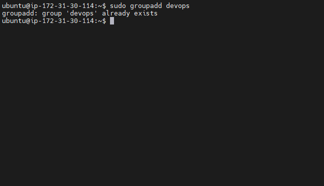

I then went on to create 5 new users called `mary` `mohammed` `ravi` `tunji` and `sofia`

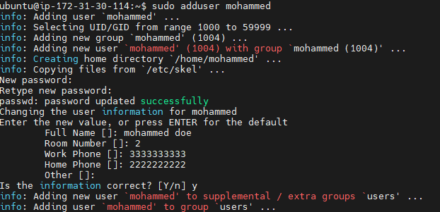

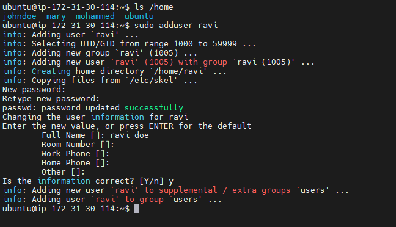

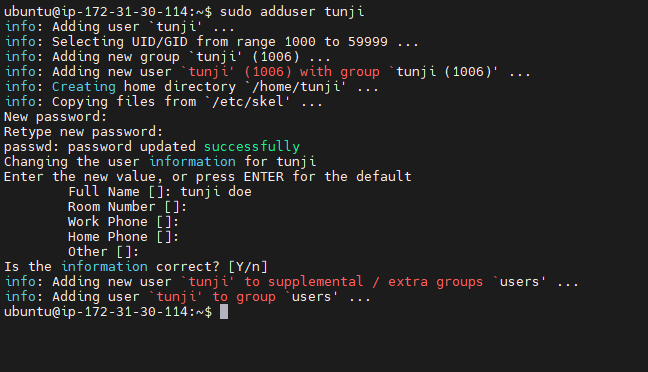

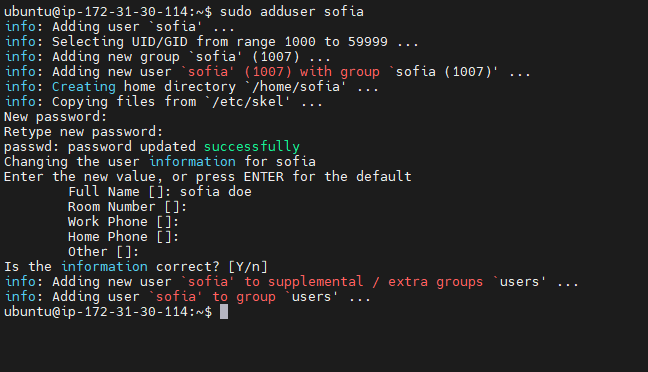

After creating the new users, folders were automatically created for them in the `/home` directory

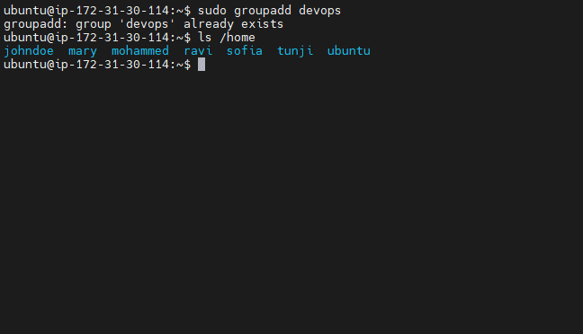

Finally I changed group ownership of each of the folders to `devops` group

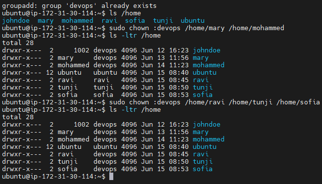

And with that my project is complete.