# Enhancing Community Library Website

I logged into my GIT Hub repository and created a new repository called `greenwood-library-website`

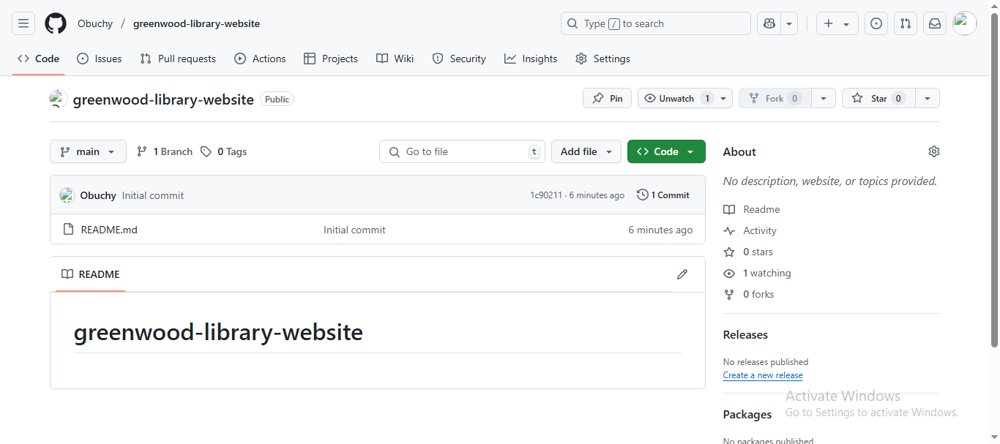

I then opened my git cloned the repository into my local device

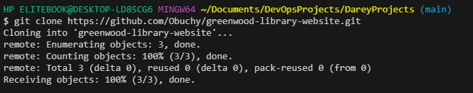

I followed that up by created html files for the 4 sections of the website

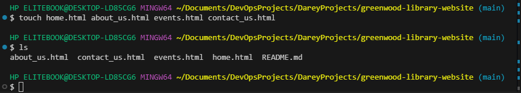

I opened the `about us` file and added some content to it

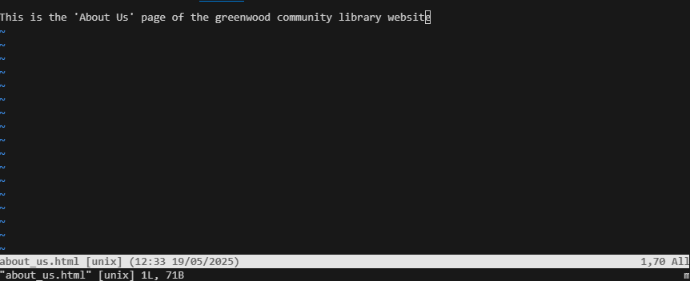

I opened the `contact us` file and added some content to it

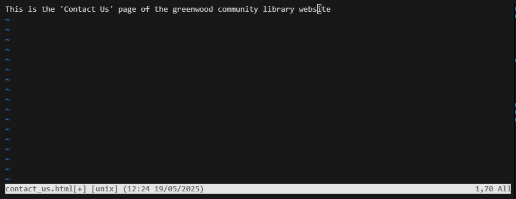

I opened the `events` file and added some content to it

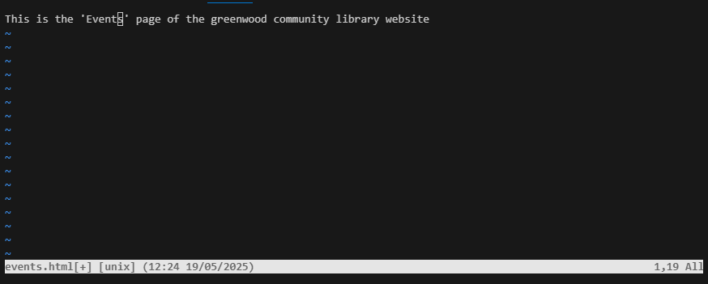

I opened the `home` file and added some content to it

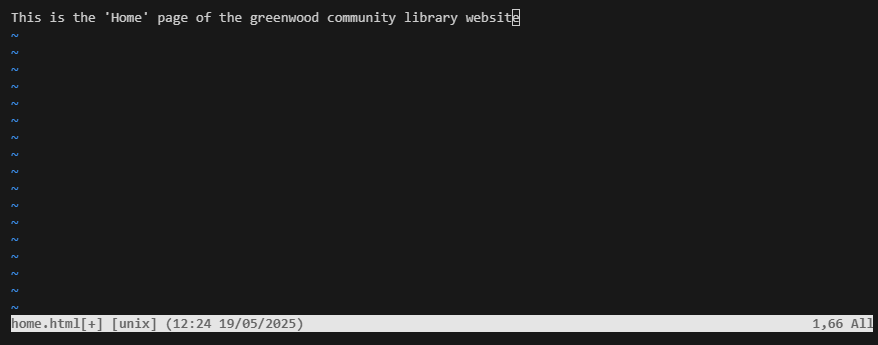

i then staged, commited and pushed to my GIT Hub repository

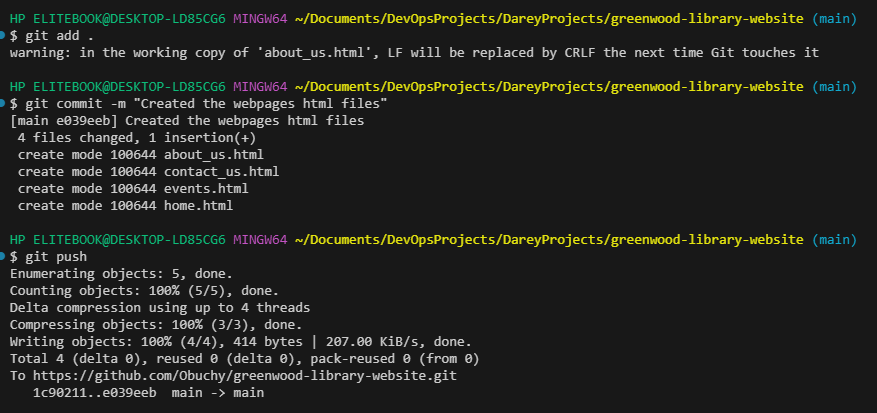

I created and switched to a new branch called `add-book-reviews`

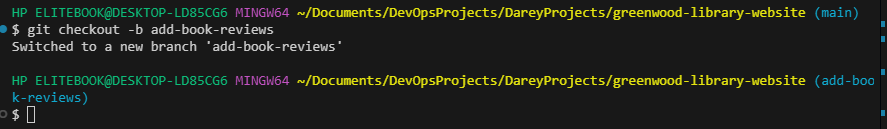

I then created another html file called `book_reviews.html`, added text content to it, then staged, commited and pushed to the GIT Hub repository

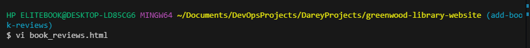

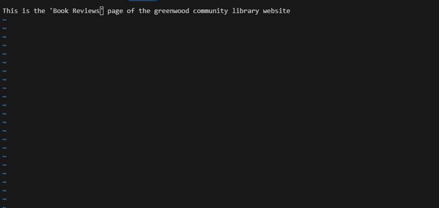

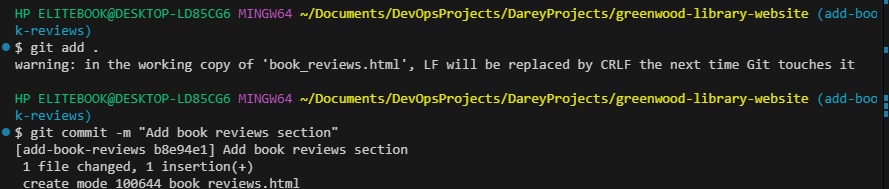

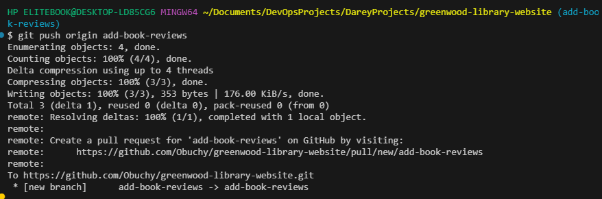

I subsequently went to my GIT Hub repository and created a pull request for Morgan's updates, reviewed them an merged it with the main branch

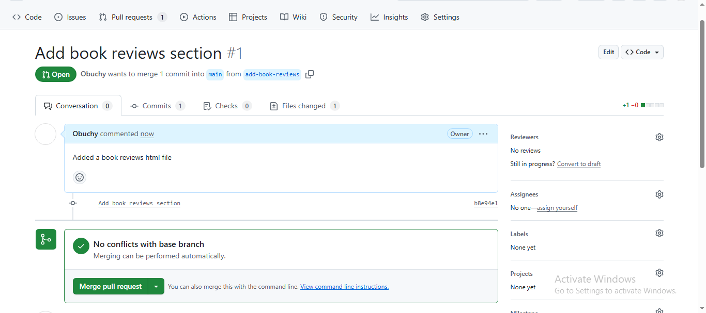

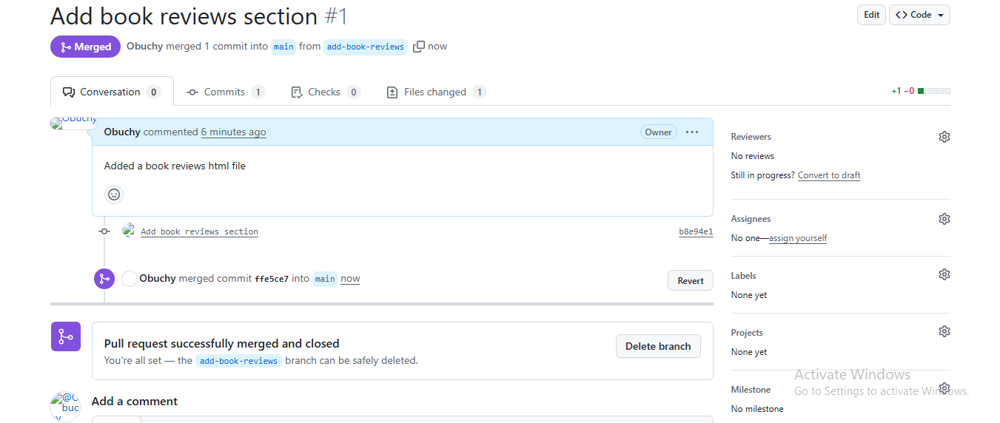

I then created a new branch for Jamie called `update-events`, I pulled all the changes from the main branch into the update-events branch

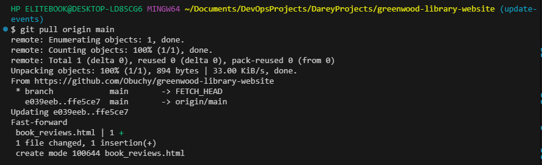

I then simulated Jamie adding the upcoming events into the events page by adding more content into the events.html file 

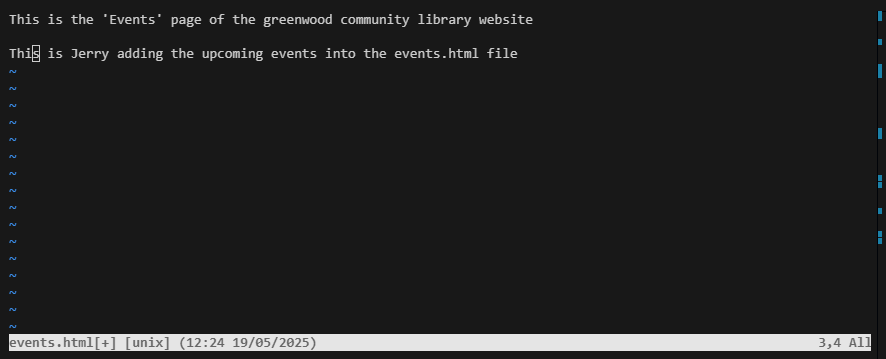

I then staged, commited and pushed to my GIT Hub repository

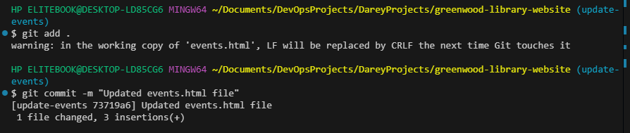

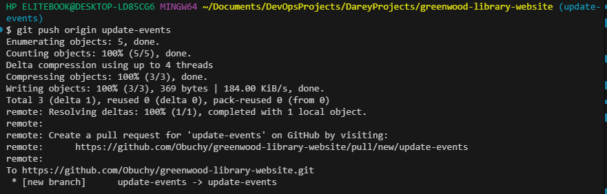

Lastly, I went to my GIT Hub repository, created a pull request for Jamie's work, reviewed it and merged it with the main branch

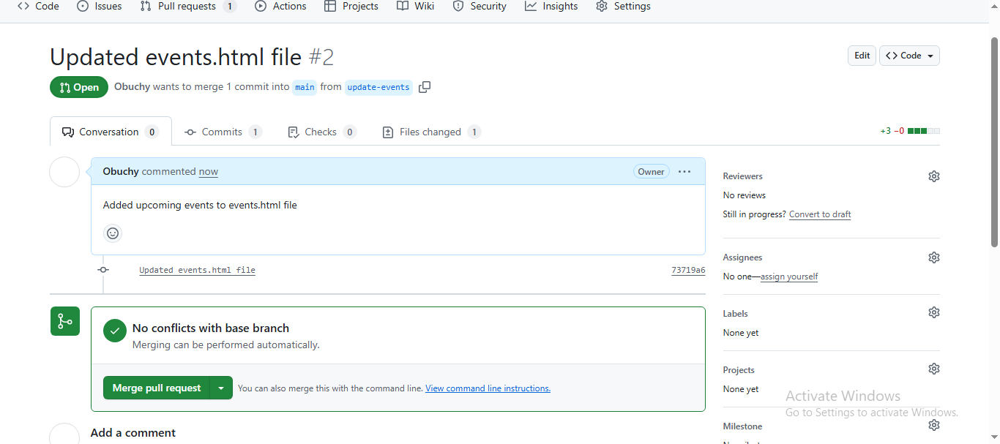

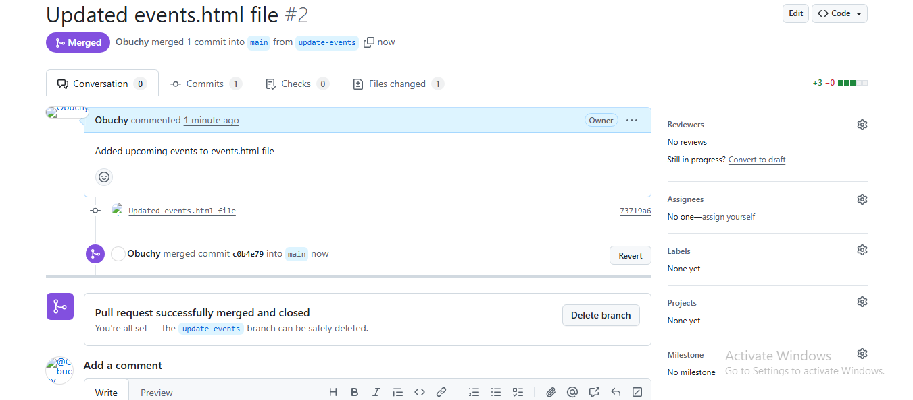