# GIT Basic Commands

## GIT

First of all I installed GIT on my device

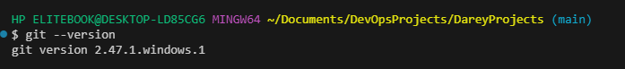

## GIT HUB Repository

I followed that up by creating a GITHub repository called `ai-startup-website`

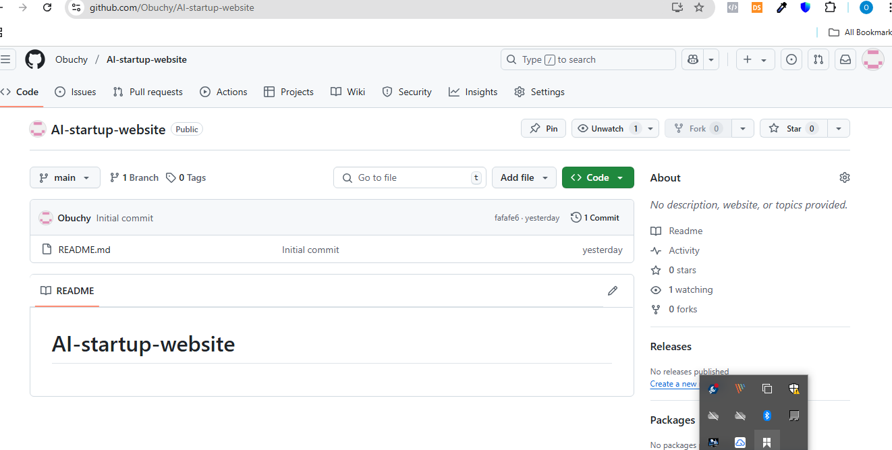

## GIIT Project Folder

I went to my terminal, then went to my folder where I store all Darey.io work and created a folder called `git-project`

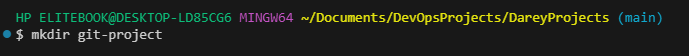

I switched folder to the git-project folder 

I subsequently cloned the git repository, ai-startup-website, into the git-project folder I created

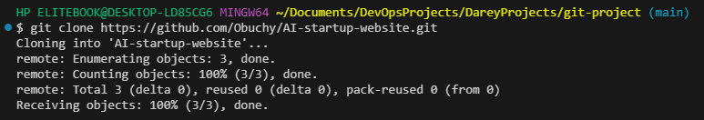

I switched to the ai-startup-website repository and created a html file called index.html

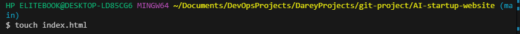

I added content to the index.html file

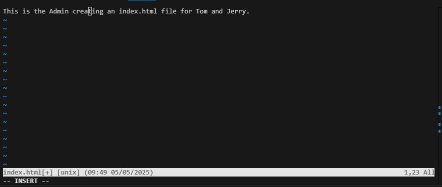

I saved and exited the file, then i checked the status of the file to show it had not been staged 

I then staged the index.html file by using the command `git add`

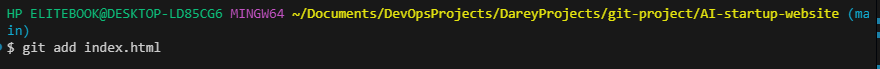

I checked the status of the index.html file again to confirm it had been staged succesfully

I then commited/saved the file using the command `git commit`

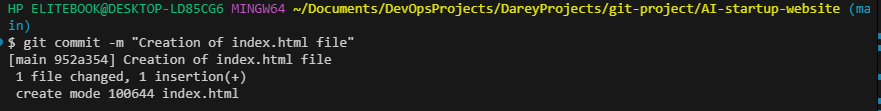

I followed that up by pushing the file to the GIT Hub repository

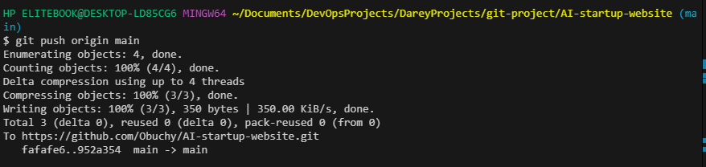

I checked the branch I was working on and confirmed it was the main branch

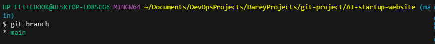

I created a new branch for Tom's work called `update-navigation` and automatically swithed to it using the command `git checkout -b update-navigation`

I confirmed my branch was now the update-navigation branch

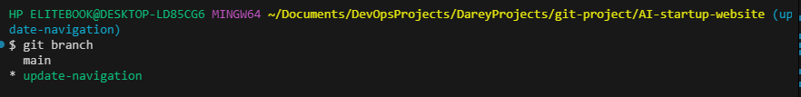

I then added content into the index.html file in Tom's branch

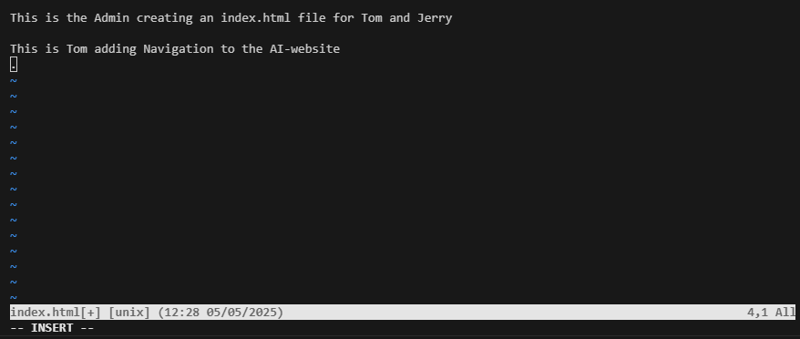

I exited the index.html file and checked the status of the file in Tom's branch

I then staged the file

I checked the status to confirm it had changed

I commited the file

Then I pushed it to the GIT Hub Repoitory

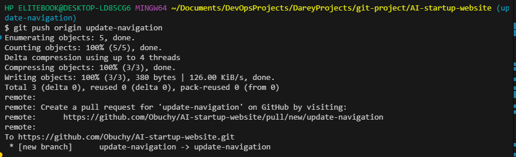

I subsequently switched back to the main branch 

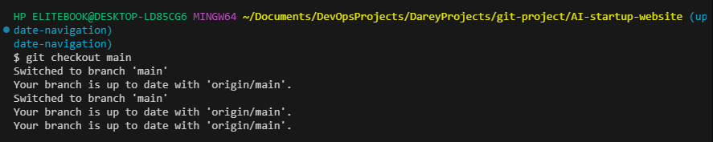

On the main branch, i created a pull request to ensure im working with the most updated version of the files and folders using the command `git pull origin update-navigation`

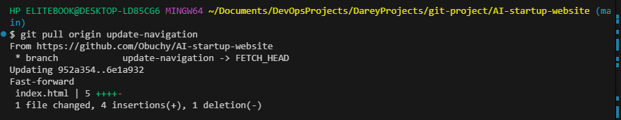

I then created a new branch for Jerry's work called `add-contact-info` and automatically swithed to it.

I then opened the index.html file in Jerry's branch and added content to it

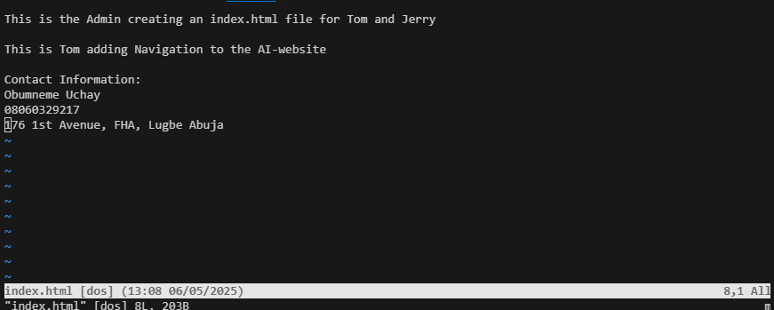

I then saved the file and exited, then staged the index.html file in Jerry's branch

I commited the file

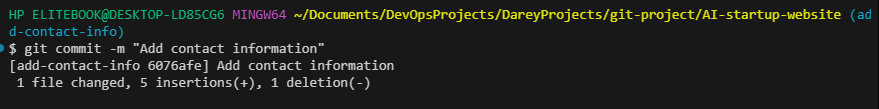

I then pushed the file to GIT Hub repository

