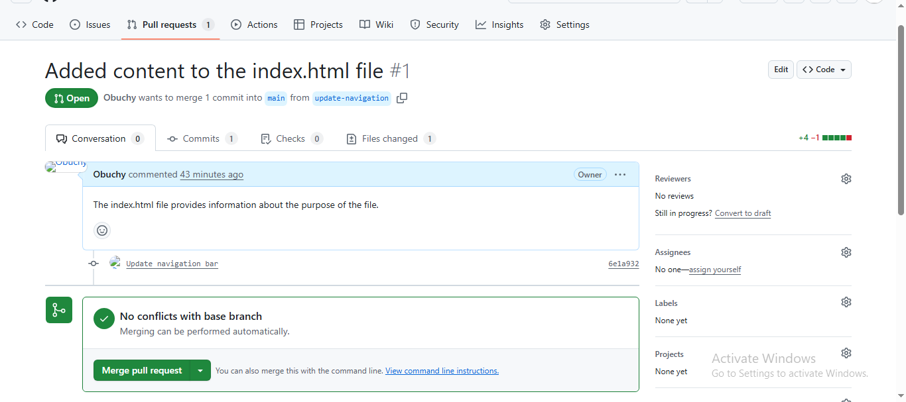
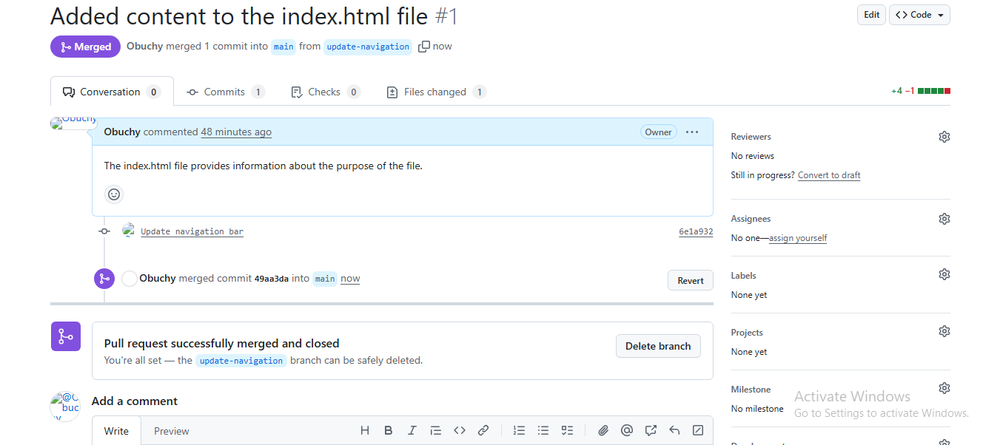
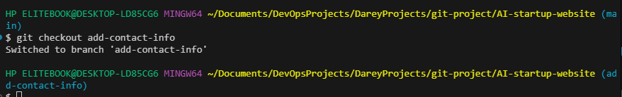
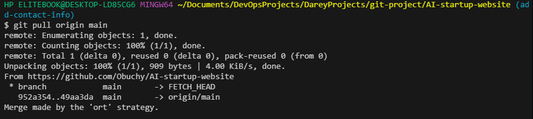
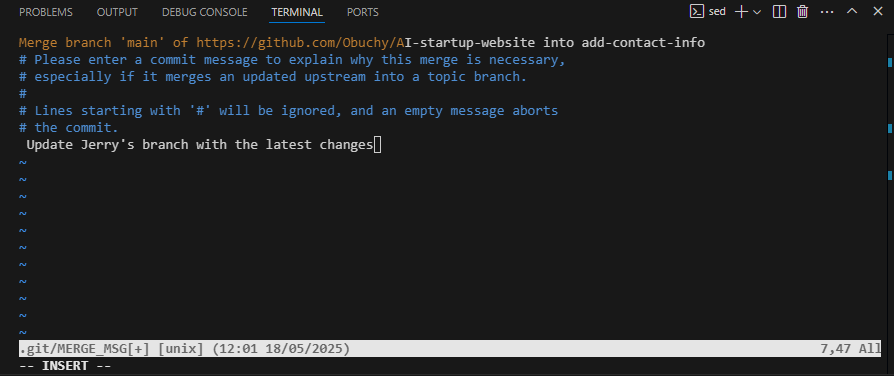
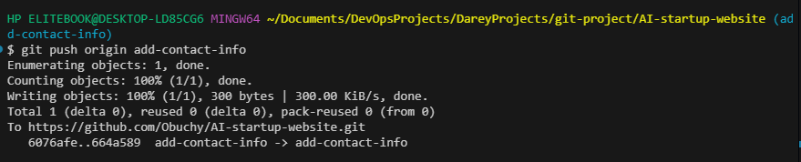
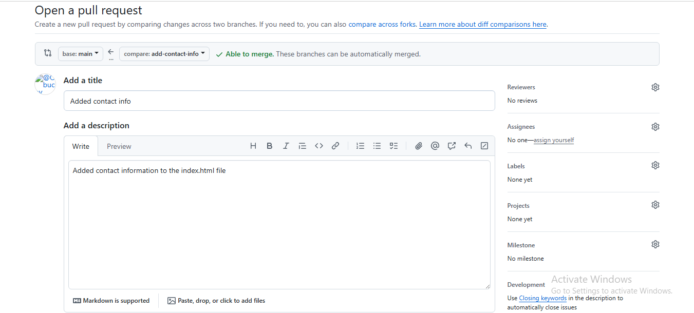
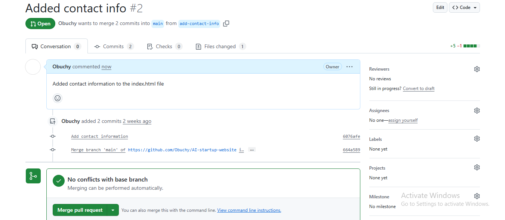
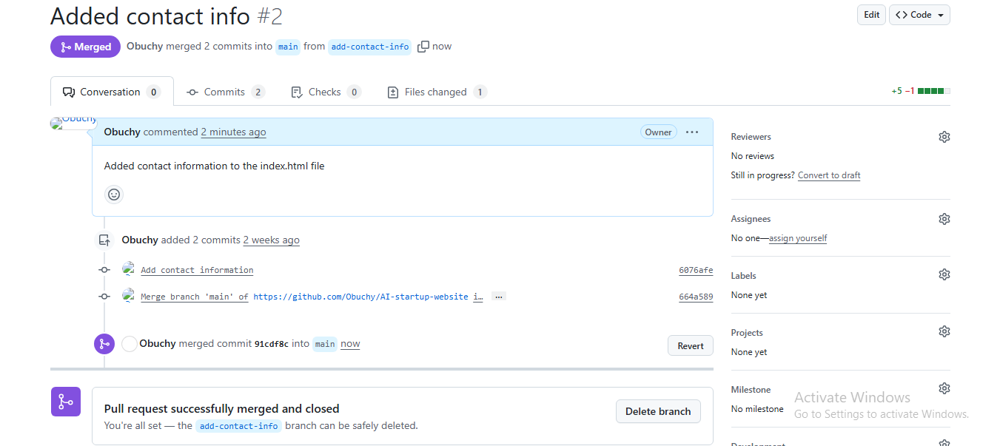

# GIT Branching and Merging

I opened my GIT Hub repository and switched from the main branch to the `update-navigation-bar` branch and created a pull request. The pull request was reviewed and then merged with the main branch.

# Jerry's Branch

I then switched to Jerry's branch and created a pull request to make sure jerry is working on the most updated version of the file including Tom's changes. I subsequently merged merged the main branch with Jerry's branch on my device and pushed it to my GIT Hub repository.

I then went to my GIT Hub repository and created a pull request, it was reviewed and finally merged with the main branch

