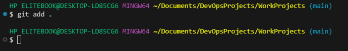

# GIT Version Control Basics

## GIT Clone

Tom and Jerry both clone their GIT HUB repositories into their devices

## GIT Pull

They both create pull request to get the latest updates from the GIT HUB repository into their local devices

## GIT Add

They both make changes to the repository and push their changes to the staging directory

## GIT Commit

After the changes were pushed to the staging directory, they were saved uing the command `gitcommit`

## GIT Push

Once the changes are commited they are pushed to the GIT Hub Repository using the command `gitpush`

## GIT Hub Dashboard

After all the changes are pushed to the repository, they log into the GIT Hub dashboard 

## GIT Hub URL

