I opened up my terminal and connected to my virtual server using `ssh`

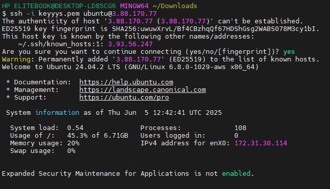

I tried to create a directory in the home directory of the root user but was denied because I didnt have permission

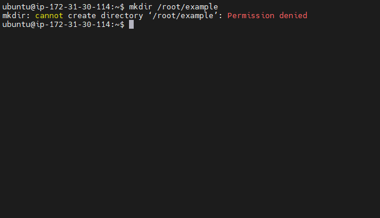

I then used the `sudo` command to run the same command and this time it was successful

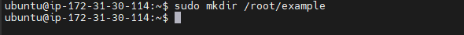

I then confirmed the folder had been created by listing the contents of the `/root` folder

I used `pwd` to find the path of my current working directory

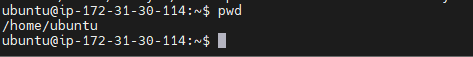

I then switched to the root directory and listed its contents

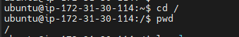

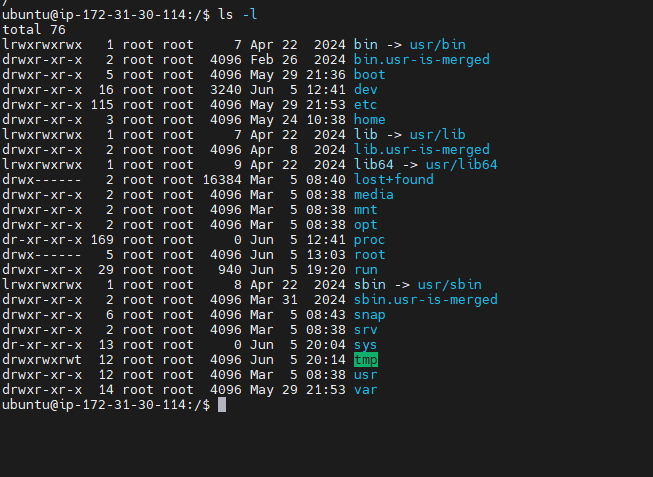

I followed that up by switching to the `/usr` folder, I created a directory called `photos`, I then switched to the photos directory and created 3 more directories called dir1, dir2 and dir3.
I switched to dir1 and showed the file pth using the `pwd` command

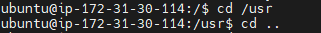

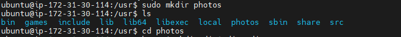

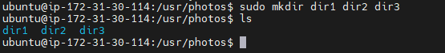

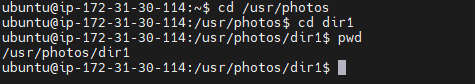

I then viewed the files and directories in my documents folder using the `ls` command on my Documents folder

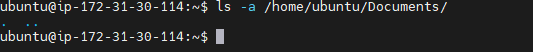

I used the cat command to view the contents of the `os-release` file in the `etc` directory

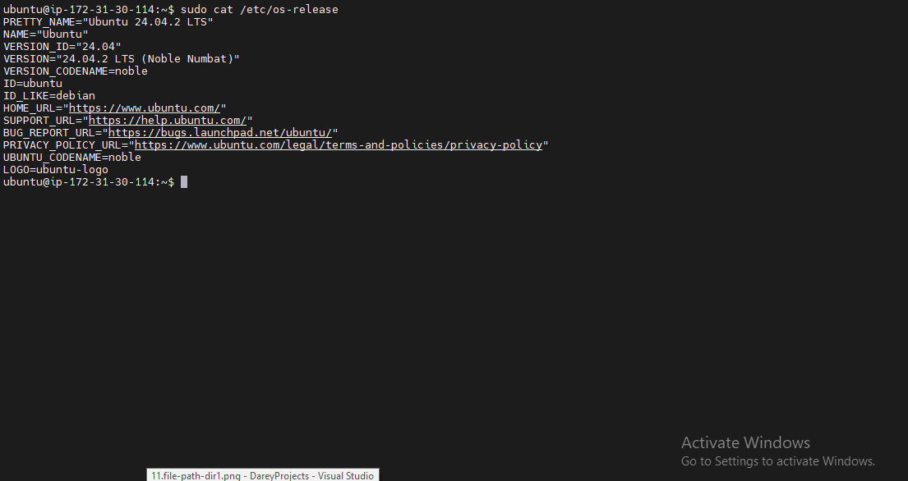

I created a foldder called `file.txt` and copied it into the Documents folder using the `cp` command

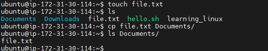

I then created 3 more files called file1.txt, file2.txt, file3.txt and copied them into the Documents folder. I then copied the contents of a file into another file as well as copied contents of a directory into another directory

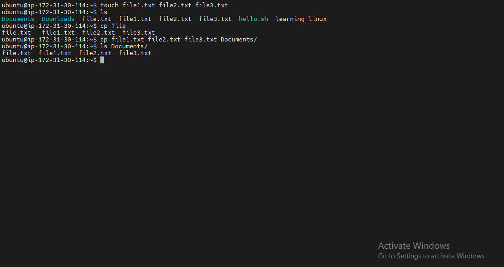

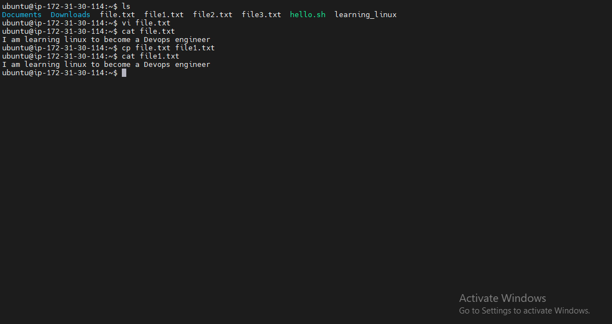

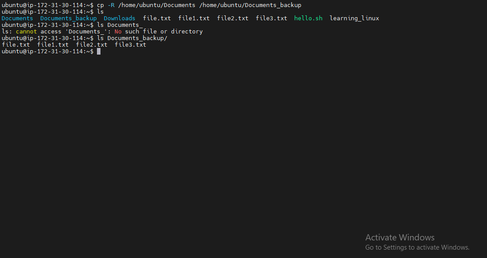

I then moved file.txt to the Documents folder using the command `mv`. I used the same cmmand the renme the file to firstfile.txt. I followed that up by using the `rm` command to delete file.txt, and subsequently used it to delete file1.txt, file2.txt and file3.txt. I then used the `touch` command to create a web file in the Documents directory. 
Finally I used the `find` command to file a file using its name in the home directory and all its sub directories

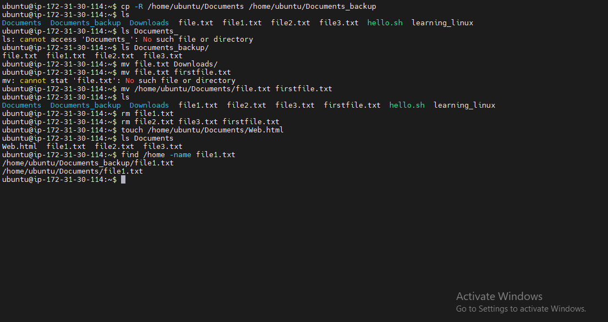