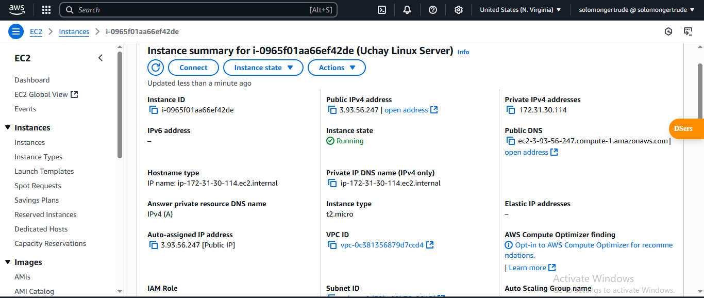
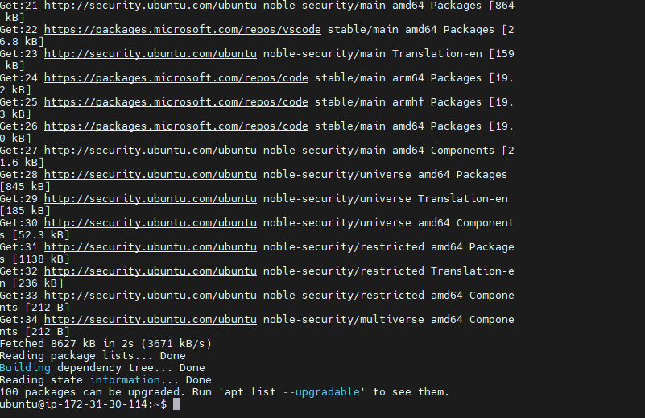

# Linux Fundamentals

I visited to AWS website and created a new AWS account and went ahead to launch an EC2 instance 

I then took the public IP address of the instance and opened up my Mobaxterm, opened the terminal, changed directory to the `Downloads` folder which contains my pem key and connected to the virtual server I created on AWS using `ssh`

I updated the existing packages, installed tree command, verified the tree command had been installed by using it on some directories.

I then updated the packages I had installed and followed that up by removing the tree command

Lastly I installed `Nginx` on my virtal server

