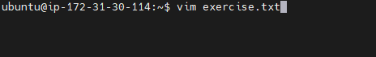
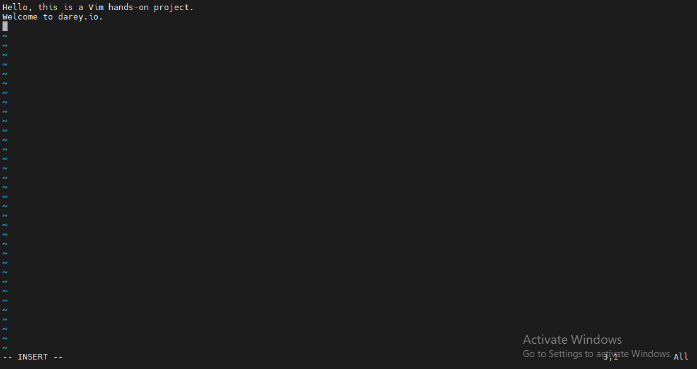
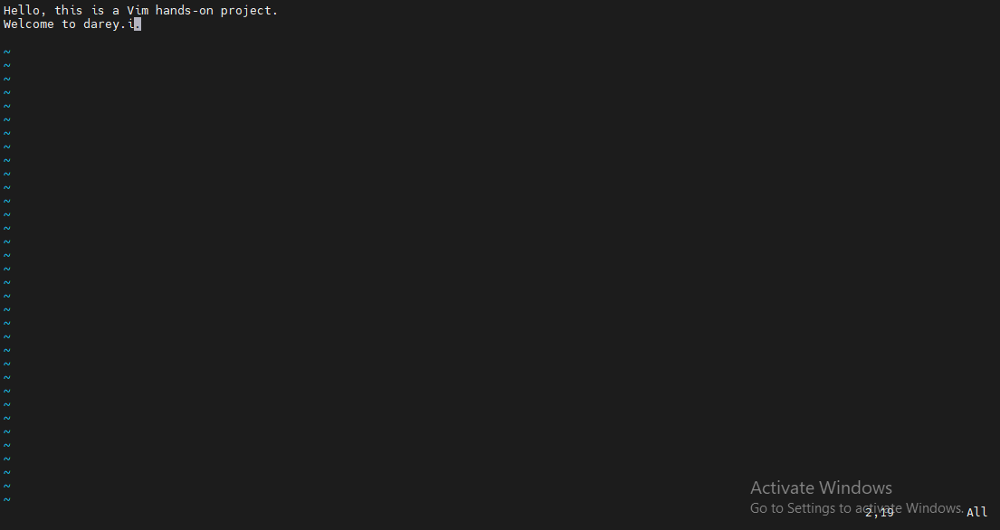
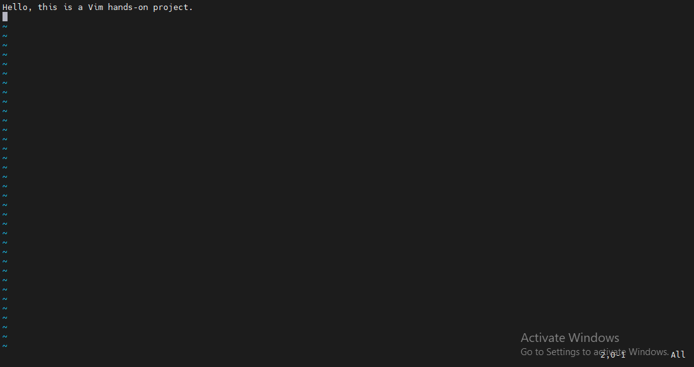
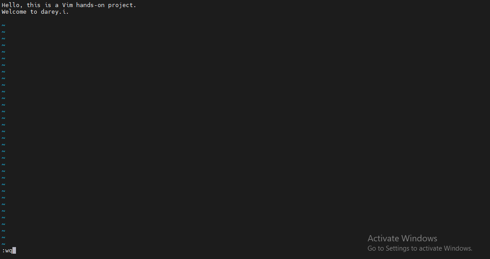
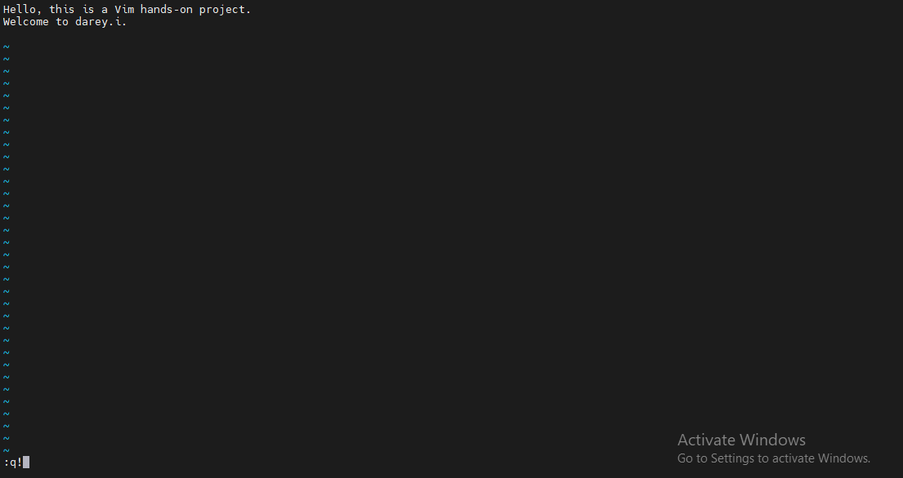
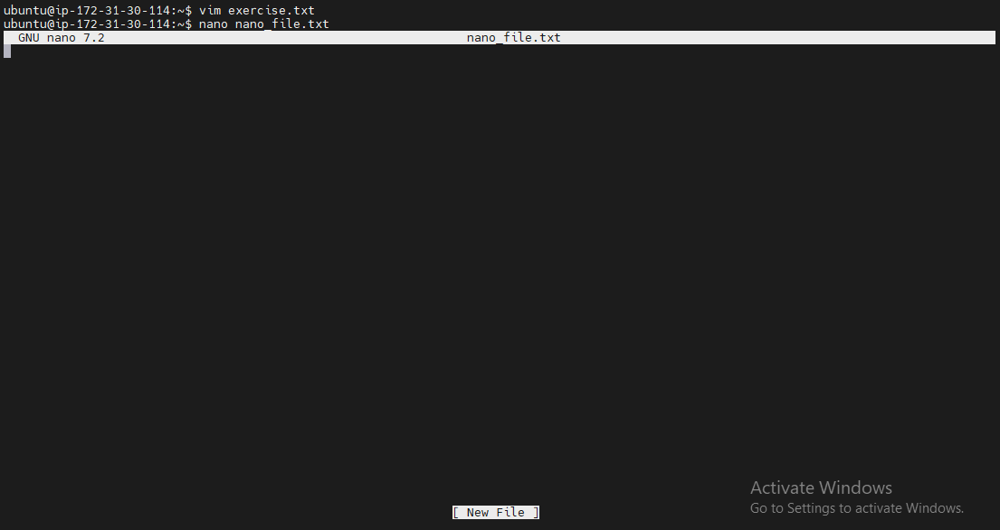
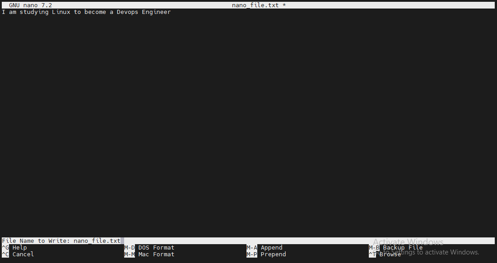
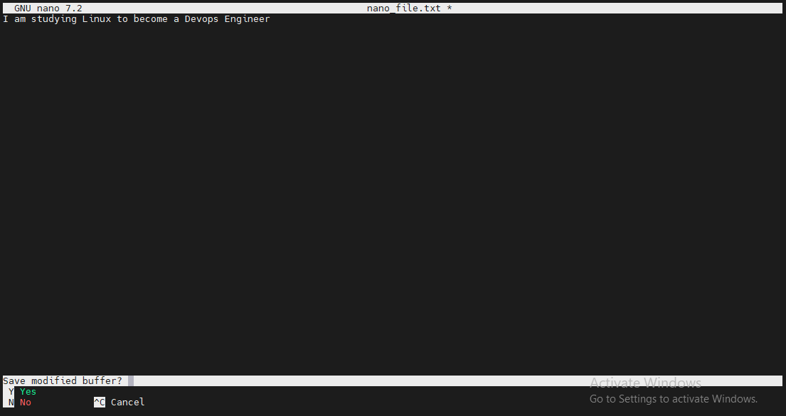
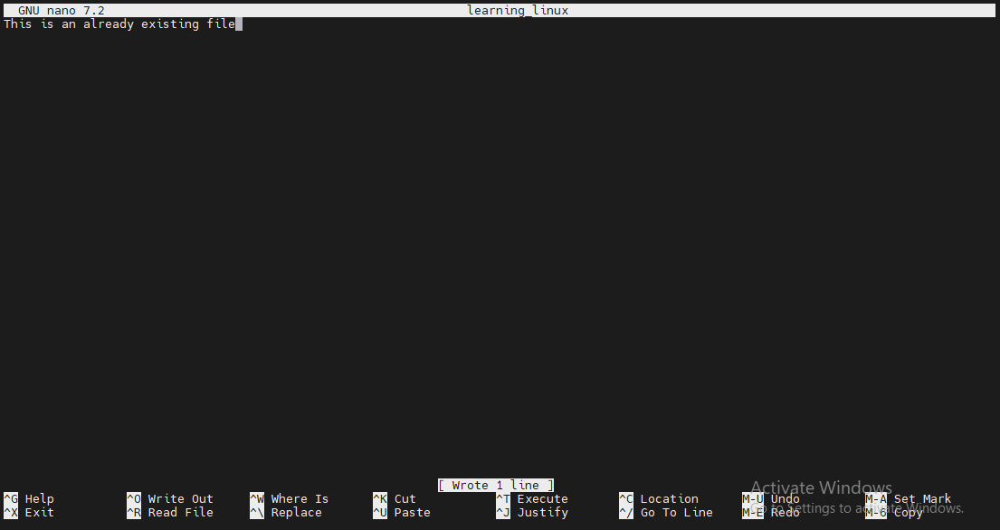

# Linux Text Editor

I created a file called `exercise.txt` using the `vim` command

I added text to the file, deleted one letter in the text, deleted one line, undid the last change and finally saved the changes

I tthen went back into the file and exited without saving

I subsequently used the `nano` command to create a file called `nano_file.txt`. I added some text to the file, saved changes, reopened the file and exited without saving.

Finally, I used nano to edit an already existing file

