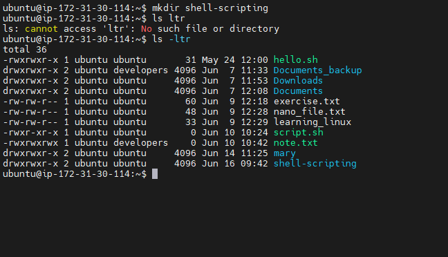
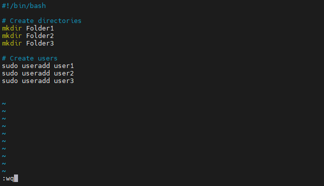
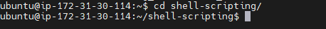
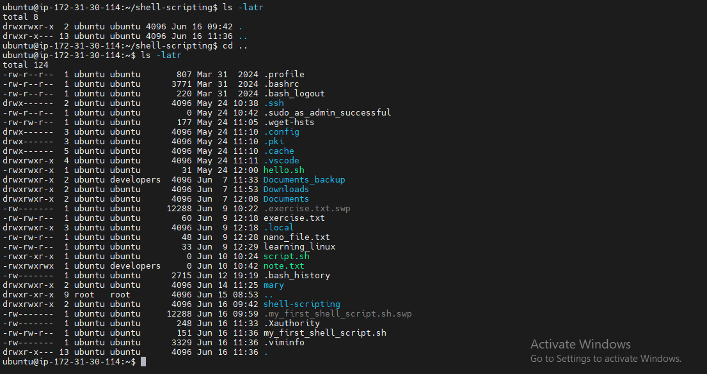
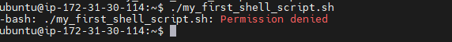
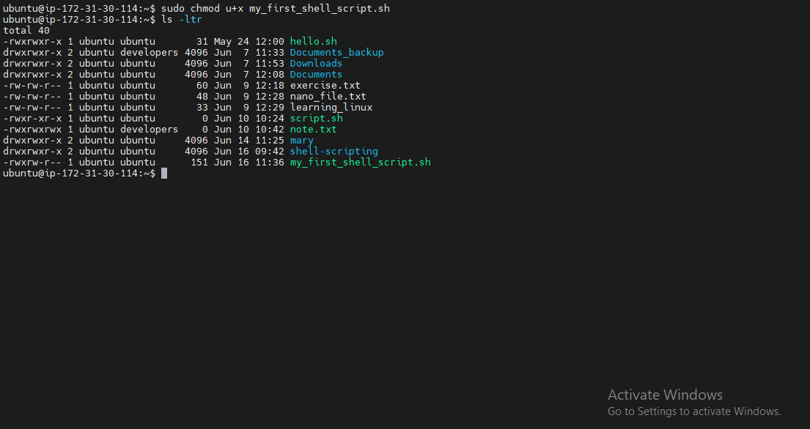
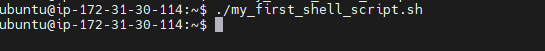
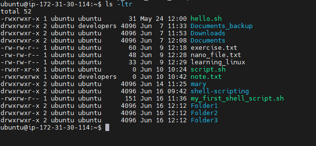
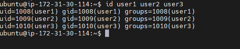
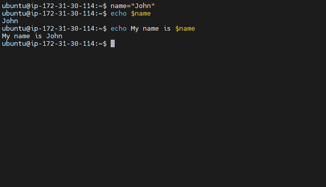

# Shell Scripting-Mini

I created a folder on the ubuntu server called `shell-scripting`

I then used the vim editor to create a file called `my_first_shell_script.sh`

I then put the script provided into the file `my_first_shell_script.sh`, saved and exited it.

I followed that up by changing directory into the newly created directory called `shell-scipting`. 

I then used the command `la -latr` to confirm the file `my_first_shell_script.sh` was actually created

I tried to execute the shell script file `my_first_shell_script.sh` but permission was denied because the file did not have the execute permission.

I then used the `chmod` command to grant the file owner of `my_first_shell_script.sh`execute permission

I followed that up by running the script, the script created 3 new folders and 3 new users; `folder1`,`folder2`, `folder3` and `user1`, `user2`, `user3` respectively

Lastly, I assigned the name `john` to a variable called `name` and used the `echo` command to print john on the terminal. i then went on to print the sentence `My name is john` on the terminal by using the `echo`command and the variable

