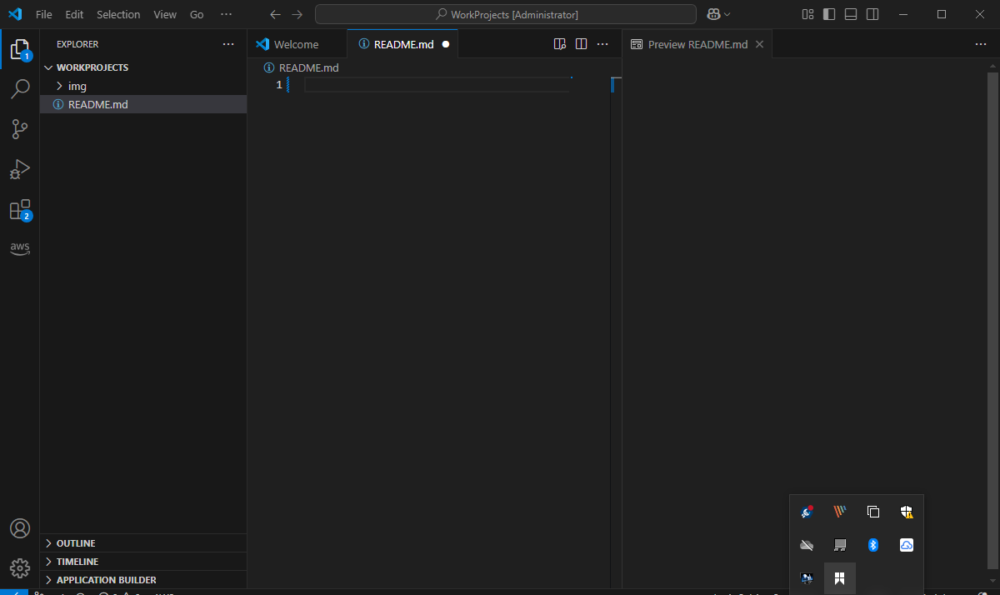
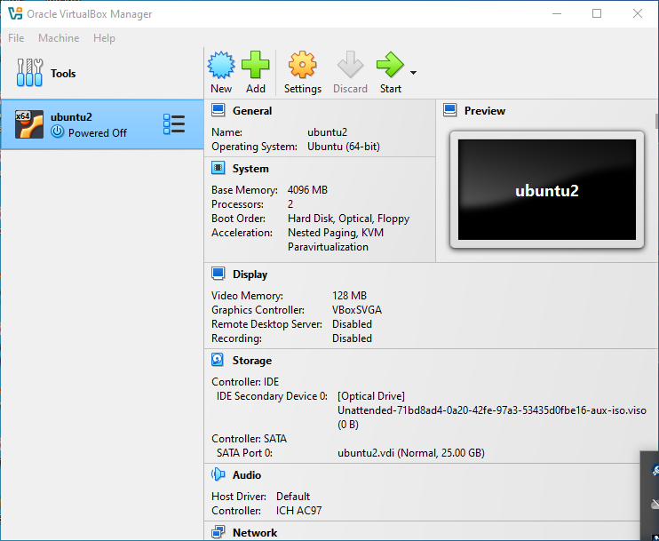
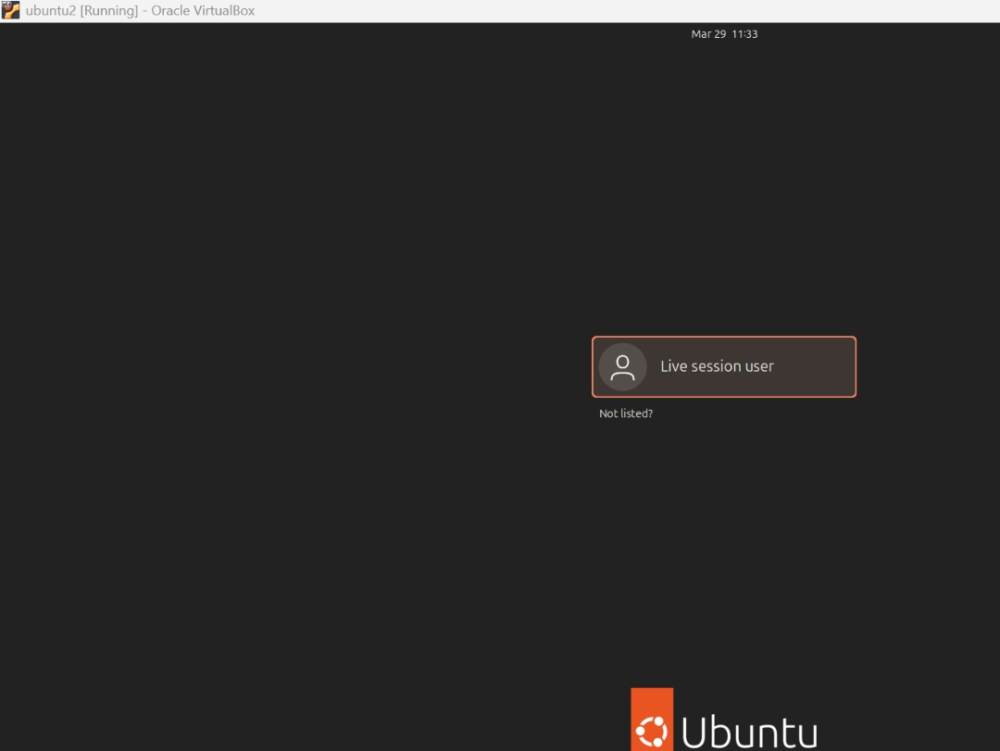
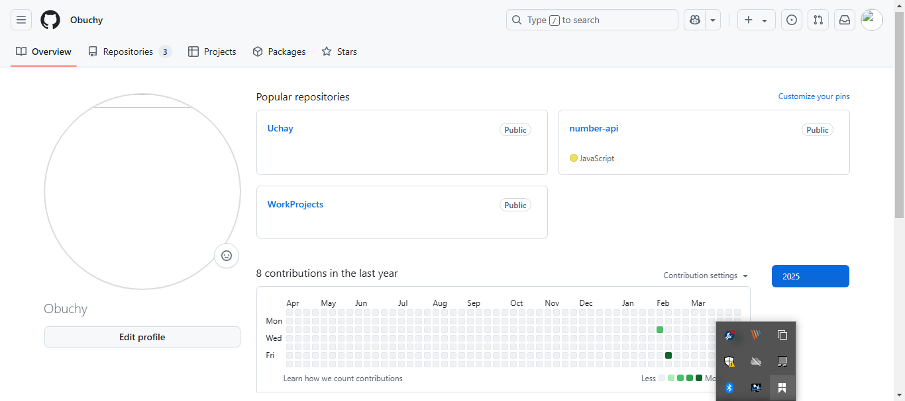
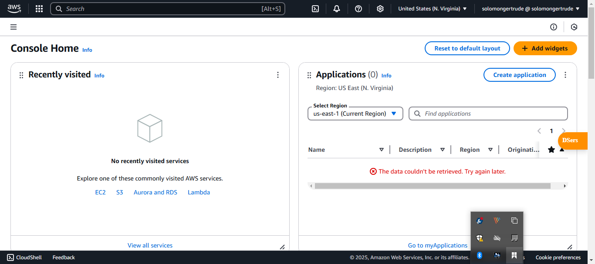

# Tech Environment Setup
In this mini project, I installed a few tools and created some accounts which are very neccessary in my DevOps journey.

## Visual Studio Code (VScode)
I installed vscode on my device. To do this, I went to the vscode website
<https://code.visualstudio.com/>

clicked on `Download for Windows` to download the installer and followed the steps to install it.

## GIT
I proceeded to install `git` on my device, to achieve this I went to the website through the link:

<https://git-scm.com/downloads/win>

I then clicked on `64-bit GIT for Windows Setup` to download the installer. After downloading the installer I ran it to complete the installation

## Virtual Box

I then followed up with downloading Virtual box by visiting the website:
https://www.virtualbox.org/

On the website I clicked on `Download` to download the installer. 
After successfully downloading it I ran the installer and followed 
the steps to complete the installation.

## Ubuntu
I installed the ubuntu desktop ISO file by downloading it from the website
<https://ubuntu.com/download/desktop>

I then created a virtual machine on virtual box and attached the ubuntu ISO file I had 
downloaded earlier, then followed the remaining steps to successfully set up 
my ubuntu virtual machine on virtual box

## GIT HUB

I visited the github website through the link <> after which I clicked on sign up and followed the next steps to create an account with the username `Obuchy` 

## AWS

I visited the AWS website and clicked on sign up to start the process of creating an AWS account, I followed all the steps and successfully created the account

